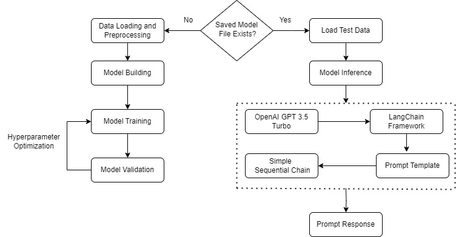
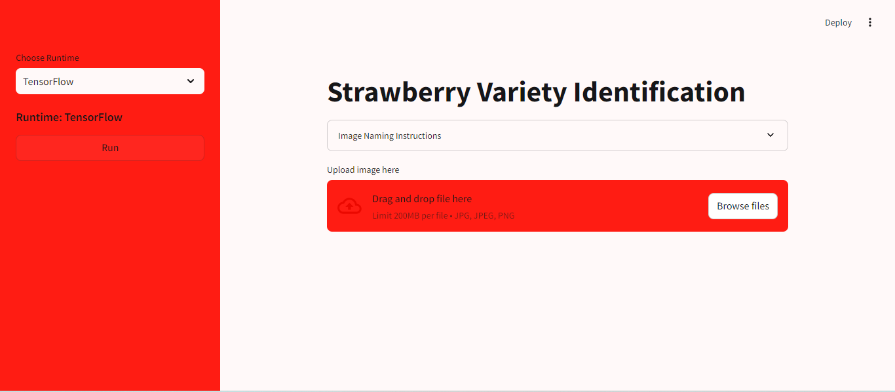

# Strawberry Variety Identification

A web application that employs a CNN-based multi-class strawberry variety classification. The predicted label is then used to feed a Large Language Model (LLM) for detailed information on that particular strawberry variety. The entire codebase is built and deployed using Streamlit.

## Table of Contents
1) Introduction
2) Features
3) Project Workflow
4) Dataset
5) Installation
6) Project Structure
7) Models
8) Usage
9) License
10) Acknowledgement

## Introduction
This project aims to classify different varieties of strawberries using a Convolutional Neural Network (CNN). Once classified, the predicted label is used to retrieve detailed information about the strawberry variety from a Large Language Model (LLM), using the LangChain framework to access OpenAI's GPT-3.5 Turbo model. The project is presented as a user-friendly web application using Streamlit.

## Features
- `CNN-based Classification`: Multi-class classification of strawberry varities
- `LLM Integration`: Detailed information retrieval for each classified strawberry variety.
- `Streamlit Web App`: Interactive and user-friendly web interface.

## Project Workflow
Please refer to the image below for the project workflow employed.


## Dataset 
This project uses the Strawberry Variety Dataset [accessed here](https://datadryad.org/stash/dataset/doi:10.25338/B8V308), titled: *A Strawberry Database: Geometric Properties, Images and 3D Scans*.

Please cite the dataset as follows:
```
Durand-Petiteville, Adrien; Sadowski, Dennis; Vougioukas, Stavros (2018). A Strawberry Database: Geometric Properties, Images and 3D Scans [Dataset]. Dryad. https://doi.org/10.25338/B8V308
```

It consists of 1611 strawberries from different places and varieties are used to collect images, 3D scans as well as physical properties such as shape, width, height, and weight.

For the purpose of this project, we utilize images only and reduce it.

Some important characteristics:
- Total Images: 1400
- Strawberry Varieties: 1975, 269, Benadice, Fortuna, Monterey, Radiance, SanAndreas
- Images per Variety: 200
- File Extension: .jpg

### Dataset Directory Structure
```
    dataset/
    │
    ├── 1975/                
    ├── 269/
    │── Benadice/
    │── Fortuna/
    ├── Monterey/       
    ├── Radiance/
    ├── SanAndreas/
```
Please use this link to access the [dataset](https://drive.google.com/drive/folders/1QlefxOraPnvyEf50B2SGKZF8oGL8tsCA?usp=sharing).
## Installation

### Prerequisites
- Python 3.10 or higher
- pip (Pyhton Package Manager)

Clone the repository:
```
git clone https://github.com/HassanMahmoodKhan/Strawberry-Variety-Identification.git
cd Strawberry-Variety-Identification
```
Create environment:
```
conda env create -f environment.yml
```
Activate environment:
```
activate strawberry-variety-classication
```
OR
Install dependencies:
```
pip install -r requirements.txt
```
Setup environment variables. Create a .env file in the root directory and add your API key:
```
OPENAI_API_KEY=your_openai_api_key
```

## Project Structure
```
Strawberry-Variety-Classification/
│
├── assets/                     # Assets directory; contains figures and plots
│  ├── custom/                  
│  ├── pretrained/
│  └── ...
│    
├── dataset/                    # Daataset directory; contains images for each variety
│  ├── 269/                  
│  ├── 1975/
├──├── Benadice/
│  └── ...
│    
├── misc/                       # Miscellaneous directory
│  ├── file_removal.py                 
│  ├── file_restructuring.py
│
├── models/
│   ├── pretrained.keras        # Pre-trained CNN model (TensorFlow)
│   ├── pretrained.onnx         # Pre-trained CNN model (ONNX)
│   └── ...
│
├── src/                        # Source directory: contains script files
│  ├── main.py                 
│  ├── app.py
│  └── ...
│
├── test_images/                # Test Images directory: contains test images
│  ├── 269.jpg                 
│  ├── 1975.jpg
│  └── ...
│
├── environment.yml             # Environment file
├── requirements.txt            # List of dependencies
├── .env                        # Environment variables
├── README.md                   # Project README file
└── ...

```

## Models
We have trained two distinct models for the image classification tasks e.g., custom and pretrained. You can employ either the
*.keras* model or the *.onnx*.

Please access them [here](https://drive.google.com/drive/folders/1ujus8RuEOT8dAdO7PLhYnhaxZ6esCqjZ?usp=sharing).

## Usage
Executing the script:
```
python src/main.py
```
This script will run the entire pipeline (end-to-end), including model training, validation, evaluation, and finally calling GPT-3.5 Turbo for query response.

To run the web application:
```
streamlit run src/app.py
```
Navigate to *http://localhost:8501* in your web browser to access the web application.



## License
This project is licensed under the Apcahe 2.0 License - see the LICENSE file for details.

## Acknowledgement
- Thanks to [OpenAI](https://openai.com/) for providing the LLM API.
- Thanks to the [Streamlit](https://streamlit.io/) community for the amazing framework.